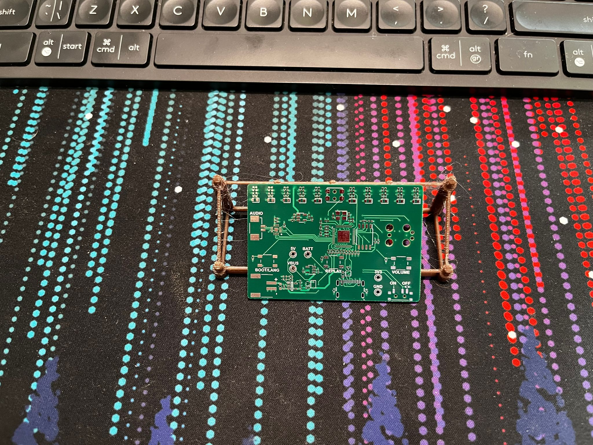
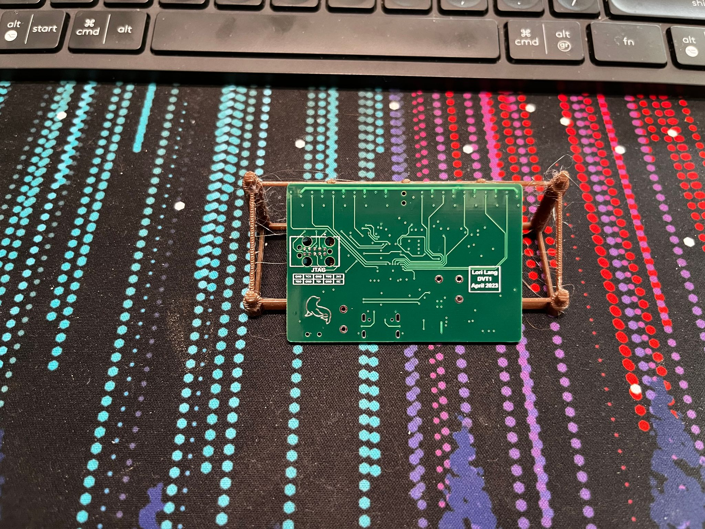
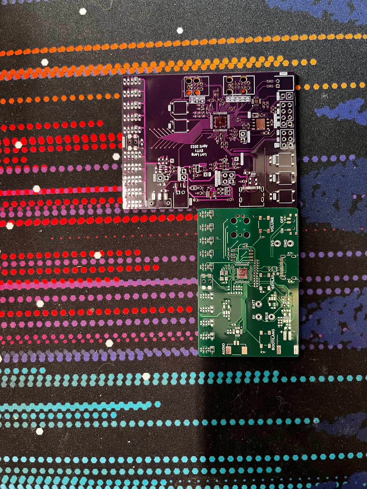
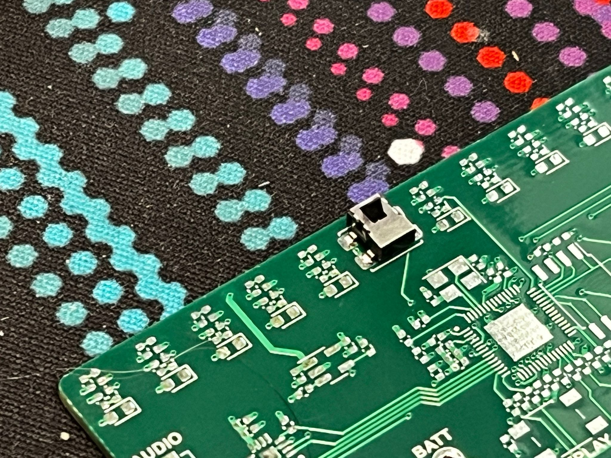
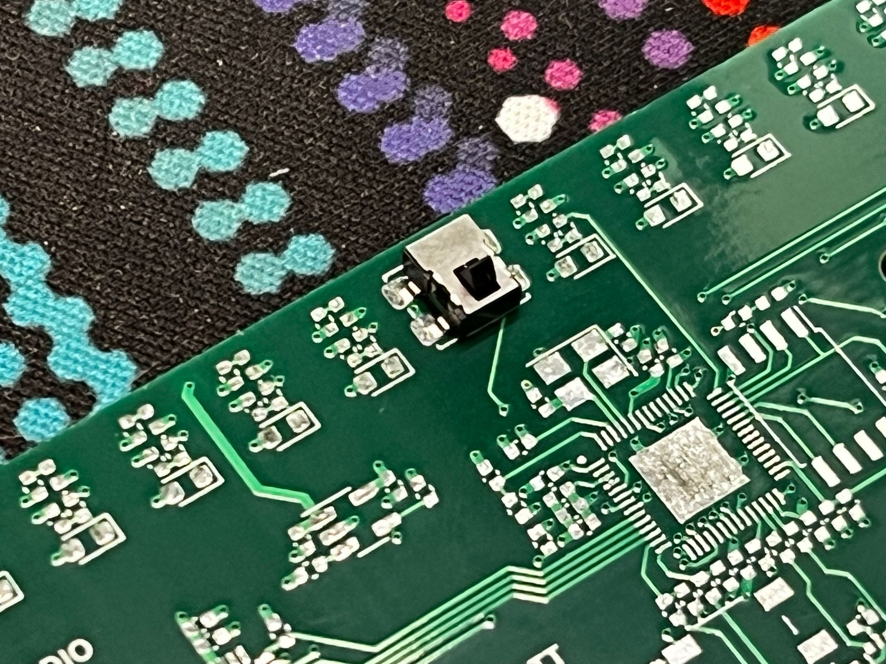
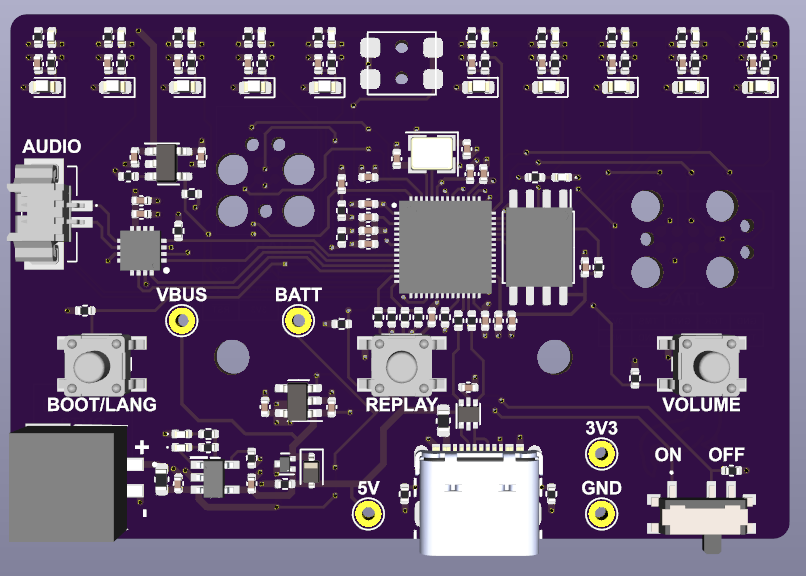
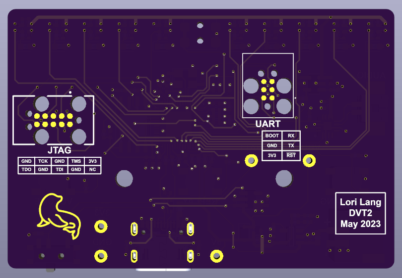
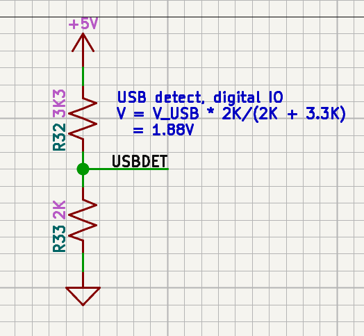
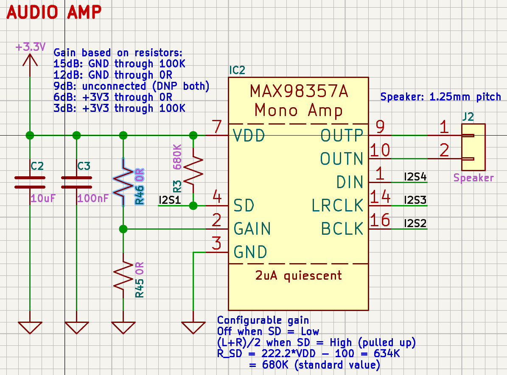

# DVT

## DVT1

*Unpopulated (front)*

*Unpopulated (back)*

*DVT1 vs EVT1*

### Issues

#### Offset card detection button

The footprint for the card detect button was upside side. It still works, but the feet are offset slightly

*Card detect button upside down*

*Card detect button rightside up*

#### Deep sleep wakeup

ESP32 supports waking up from deep sleep when GPIO pins go high. Unfortunately the buttons on DVT1 are inverted logic (normally high) so it isn't possible to wakeup from deep sleep

#### Mounting holes

I forgot to add mounting holes

#### PCB layout corruption

During development I experienced a corruption that replaced the PCB file with null bytes, but I was able to recover from the previous day's file

## DVT2

I added mounting holes and exposed UART using the TC2030 connector

*DVT2 with mounting holes and UART (front)*

*DVT2 with mounting holes and UART (back)*

### Issues II

#### Deep sleep wakeup II

I fixed the logic levels of the buttons (normally low), but forgot that GPIO0 (boot pin) has an internal pullup. This pin was being used as a GPIO and the internal pullup was overpowering the 1.1M resistor used as a pulldown. Thankfully a variable volume wasn't a useful feature anyway

#### USB detect

In the schematic I had unintentially swapped the resistor values in the voltage divider for the USB detect circuit. The first DVT board actually worked, but I eventually figured out the mistake. The ESP32S2 has a minimum voltage high input of 0.75*VDD = 2.475V compared to the incorrect voltage divider's 1.88V. This one was a very easy fix once diagnosed

*Incorrectly inverted voltage divider for USB detection*

#### Volume

I wasn't able to get EVT to play any audio and so I had set the MAX9357 (mono amp) gain to the default 9dB. This wasn't loud enough, so I modified the schematic for PVT to have a voltage divider that I could configure during PCB manufacture (R45, R46)

*Addition of R45, R46 to configure amp gain*
