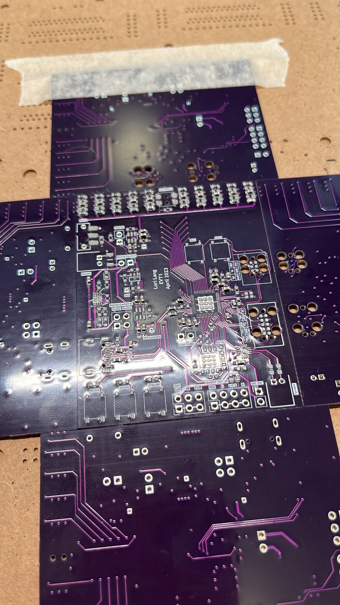
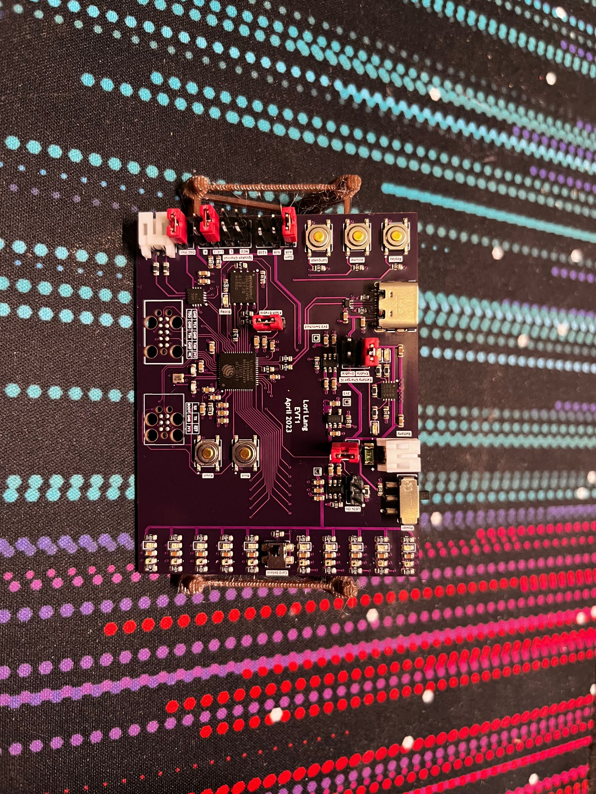
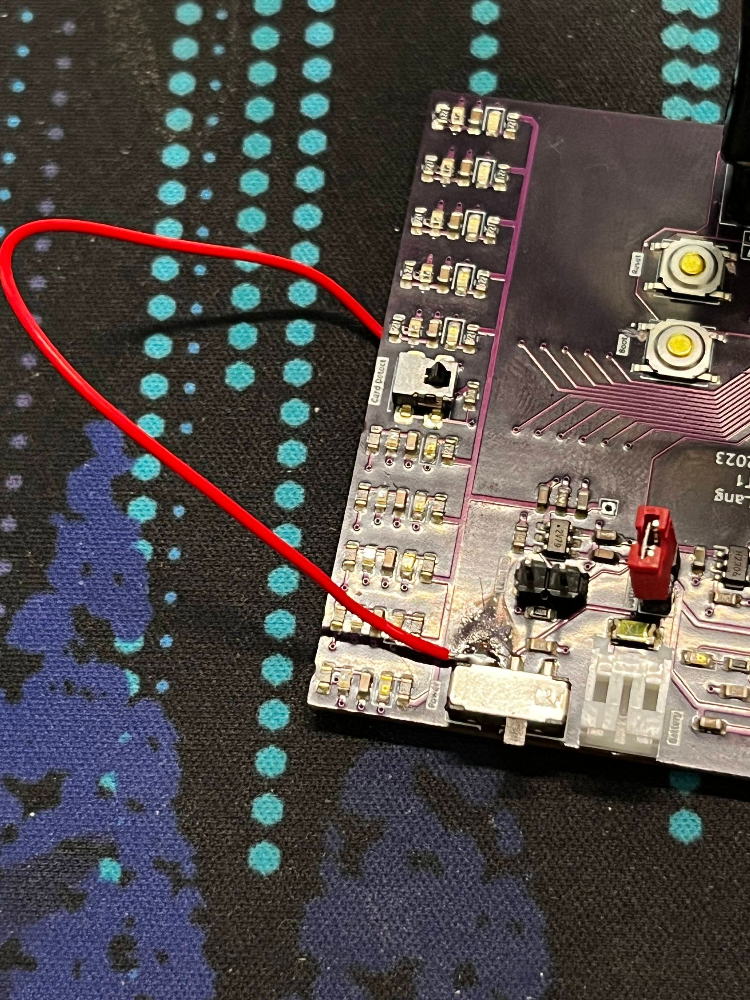
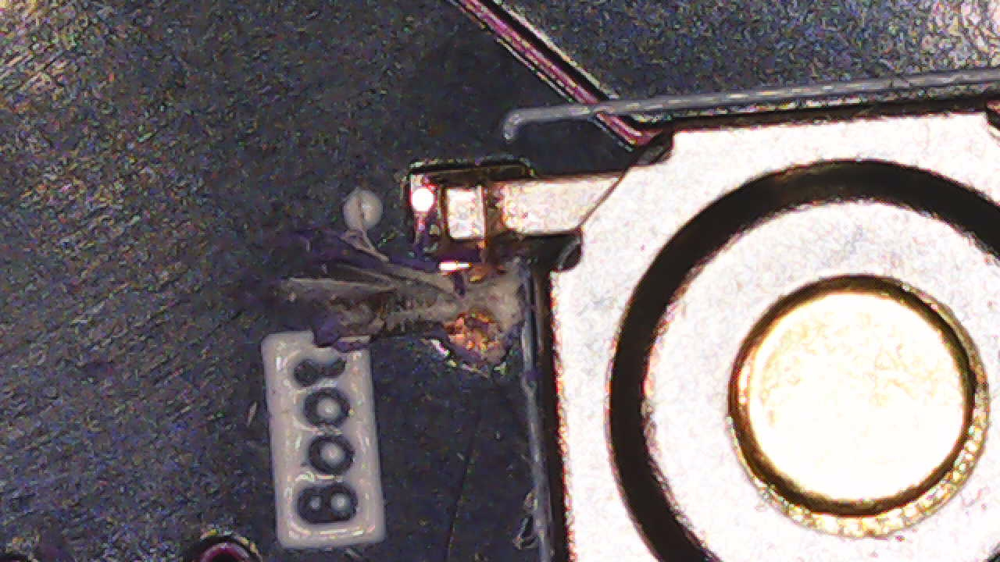
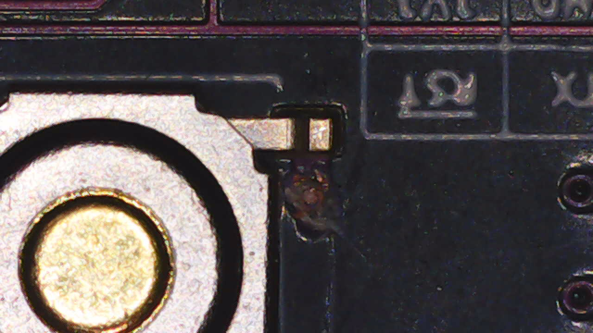
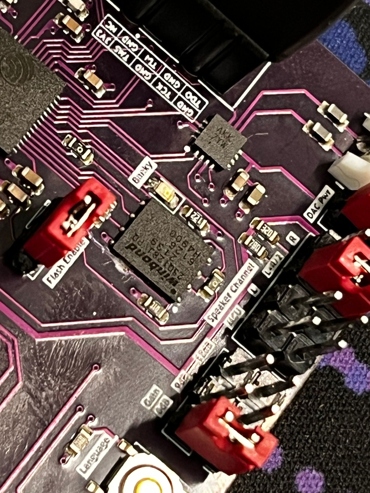

# EVT

## EVT1

*Before assembly*

*After assembly*

*After assembly, power rails working*

### Issues

#### Power switch wired to the wrong supply**

The power switch was wired to the 3V3 rail instead of the battery/USB supply

* 3V3 supply is only active when switched on, meaning that it can never be switched on
* Fixed by cutting the trace and soldering a jumper wire to the correct supply

*Jumper wire added*

#### Incorrect button footprints

SPST switch footprints were incorrect, causing all buttons to be permenantly "on"

* Reset and boot buttons prevented the ESP32 from booting properly
* Fixed by cutting all button traces, but now none of the buttons work

*Traces cut on buttons*

#### External flash clashing with internal ESP32 flash

* External flash was wired to use the SPI0 bus, conflicting with the embedded flash on the ESP32
  * Prevented the ESP32 from being able to be flashed with firmware
  * Fixed by cutting the chip select trace, disabling the external flash

*Traces cut on external flash*
